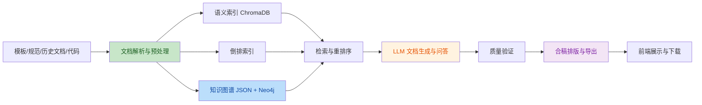
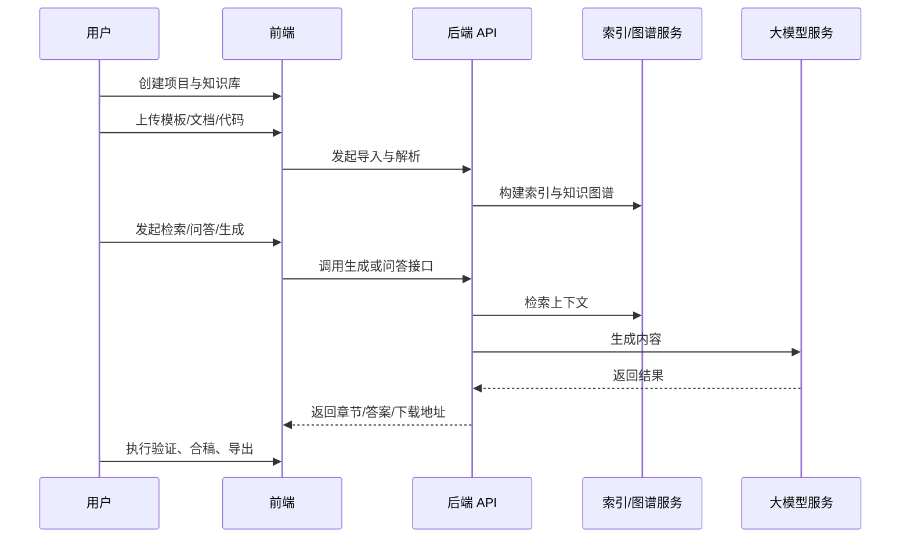

# 438C 文档生成与知识图谱系统

面向 `GJB 438C` 军用软件文档编制场景的智能文档工程平台，聚焦“文档理解、知识沉淀、内容生成、质量验证、合稿排版、问答辅助”六类核心能力，支持从模板解析到标准文档交付的全流程落地。

本项目采用前后端分离架构，后端基于 `Flask` 构建业务中台，前端基于 `Vue 3 + Element Plus` 构建交互界面，并结合 `ChromaDB`、`Neo4j`、`MinIO`、`PostgreSQL`、`Redis`、`Celery` 等组件形成完整的知识工程与文档生产链路。

## 项目定位

项目主要用于以下场景：

- 基于 438C 规范梳理军用软件文档体系
- 将已有模板、历史文档、代码资料导入知识库并形成统一检索入口
- 建立“文档类型 - 章节结构 - 术语要素 - 代码实体”的知识图谱
- 结合知识检索与大模型能力生成标准化文档内容
- 对生成结果进行质量验证、合稿排版与成品导出
- 为项目成员提供带溯源能力的智能问答辅助

## 工程描述

系统不是单一的“文档生成器”，而是一套围绕 438C 文档编制的知识驱动平台，核心思路如下：

- 先把模板、规范、项目文档、代码等资料解析成结构化知识
- 再通过向量索引、倒排索引和知识图谱建立检索与关联能力
- 在此基础上对接 LLM，生成章节、整篇文档或基于代码的说明内容
- 最后通过规则校验和 GJB 排版输出可交付文档

这使得系统既能做“文档生产”，也能做“知识沉淀”和“过程支撑”。

## 核心价值

- 标准化：内置 438C 文档类型、章节结构、提示模板与验证规则
- 知识化：支持知识库、语义检索、知识图谱和溯源问答
- 自动化：支持文档生成、质量验证、合稿排版和导出下载
- 工程化：提供前后端分离、多服务部署、离线部署与验收清单
- 可扩展：支持 Neo4j、MinIO、ChromaDB、LLM 服务按需替换和扩容

## 功能组成

### 1. 项目管理

- 管理项目基本信息、系统名称、组织单位和文档上下文
- 为知识库、生成任务、合稿任务提供项目级归属

### 2. 知识库构建

- 支持本地上传、批量目录导入、接口导入、增量导入
- 支持 `doc/docx/pdf/xlsx/pptx/txt/md/html/json` 及代码文件解析
- 支持 OCR、AST 解析、军标文档结构化拆分、文本预处理

### 3. 语义检索与知识组织

- 基于 `sentence-transformers` 进行向量化
- 基于 `jieba + 倒排索引` 做关键词召回
- 基于重排序策略综合语义、术语、元数据和知识图谱关系打分
- 支持结果溯源，定位来源文件、章节和实体

### 4. 知识图谱

- 构建“文档 - 章节 - 要素 - 术语 - 代码实体”的关系网络
- 本地 JSON 与 `Neo4j` 双持久化
- 前端通过 `D3.js` 提供独立知识图谱可视化页面

### 5. 文档生成

- 支持整篇生成、章节生成、基于代码生成
- 自动创建标准章节结构并按文档类型装载 Prompt 模板
- 支持导出下载，生成标准 `docx` 结果

### 6. 质量验证

- 检查章节完整性、要素合规性、术语规范和结构约束
- 支持规则管理、结果查询和验证等级输出

### 7. 文档合稿与排版

- 支持多文档合并
- 支持目录结构组织、页眉页脚处理、标题层级调整
- 按 GJB 风格输出标准格式文档

### 8. 智能问答

- 支持通用知识问答与 438C 专项问答
- 支持答案溯源
- 前端支持语音输入

## 整体架构



### 架构分层

- 展示层：`Vue 3 + Vite + Element Plus + D3.js + ECharts`
- 接口层：`Flask Blueprint` 提供项目、知识库、438C 标准、生成、验证、合稿、问答等 API
- 业务层：解析、切分、索引、图谱、生成、验证、问答、合稿等服务模块
- 存储层：`PostgreSQL`、`Redis`、`ChromaDB`、`Neo4j`、`MinIO`
- AI 能力层：Embedding 模型 + 兼容 OpenAI 接口的大模型服务

## 技术栈

### 后端

- `Flask 3`
- `Flask-SQLAlchemy`
- `Flask-Migrate`
- `PostgreSQL / SQLite`
- `Redis`
- `Celery`
- `ChromaDB`
- `Neo4j`
- `MinIO`
- `sentence-transformers`
- `python-docx`、`pdfplumber`、`openpyxl`、`python-pptx`
- `pytesseract`
- `tree-sitter`

### 前端

- `Vue 3`
- `Vite 5`
- `Vue Router 4`
- `Pinia`
- `Element Plus`
- `Axios`
- `D3.js`
- `ECharts`
- `Web Speech API`

## 功能页面

当前前端主要页面包括：

- 工作台：`/dashboard`
- 项目管理：`/projects`
- 知识库管理：`/knowledge`
- 知识库详情：`/knowledge/:id`
- 知识图谱：`/knowledge-graph`
- 438C 标准：`/438c`
- 文档生成：`/generation`
- 文档详情：`/generation/:id`
- 质量验证：`/validation`
- 文档合稿：`/merge`
- 智能问答：`/qa`

## 典型业务流程



## 工程目录

```text
cerateWord/
├── 438c/                         # 438C 模板样例文件
├── backend/                      # Flask 后端
│   ├── app/
│   │   ├── api/                  # REST API 蓝图
│   │   ├── config/               # 配置、标准文档定义、Prompt、规则
│   │   ├── models/               # 数据模型
│   │   ├── services/             # 解析、索引、图谱、生成、验证、问答等核心服务
│   │   └── celery_app.py         # Celery Worker 启动入口
│   ├── data/                     # 本地数据目录（向量库、上传文件、图谱等）
│   ├── requirements.txt          # Python 依赖
│   ├── .env.example              # 环境变量模板
│   ├── Dockerfile                # 后端镜像构建
│   └── run.py                    # 本地启动入口
├── frontend/                     # Vue 前端
│   ├── src/
│   │   ├── api/                  # 前端 API 封装
│   │   ├── components/           # 通用组件与布局
│   │   ├── router/               # 路由配置
│   │   ├── store/                # Pinia 状态管理
│   │   ├── styles/               # 主题样式
│   │   └── views/                # 业务页面
│   ├── package.json              # Node 依赖
│   └── vite.config.js            # Vite 配置
├── docs/                         # 项目文档
├── docker-compose.yml            # 全站多服务部署编排
├── nginx.conf                    # 前端 Nginx 配置
└── README.md                     # 项目入口文档
```

## 服务组成

当前 `docker-compose` 编排包含以下服务：

- `frontend`：前端静态站点
- `backend`：Flask API 服务
- `celery-worker`：异步任务 Worker
- `postgres`：关系型数据库
- `redis`：缓存与消息队列
- `chromadb`：向量数据库
- `neo4j`：图数据库
- `minio`：对象存储

## 快速启动

### 方式一：Docker Compose 全站启动

适合联调整体验收或部署测试。

```bash
docker compose up -d --build
```

启动后默认访问地址：

- 前端：`http://localhost`
- 后端：`http://localhost:5000`
- Neo4j Browser：`http://localhost:7474`
- MinIO Console：`http://localhost:9001`
- ChromaDB：`http://localhost:8000`

查看状态：

```bash
docker compose ps
docker compose logs -f backend
```

### 方式二：本地开发启动

适合前后端分开调试。

#### 1. 启动基础依赖

```bash
docker compose up -d postgres redis chromadb neo4j minio
```

#### 2. 启动后端

Linux / macOS:

```bash
cd backend
python -m venv .venv
source .venv/bin/activate
pip install -r requirements.txt
cp .env.example .env
python run.py
```

Windows PowerShell:

```powershell
cd backend
python -m venv .venv
.venv\Scripts\Activate.ps1
pip install -r requirements.txt
copy .env.example .env
python run.py
```

#### 3. 启动前端

```bash
cd frontend
npm install
npm run dev
```

本地开发默认访问：

- 前端：`http://localhost:3000`
- 后端：`http://localhost:5000`

## 核心接口

项目主要接口分组如下：

- `/api/project`：项目管理
- `/api/knowledge`：知识库管理、上传、搜索、审核、版本、图谱
- `/api/438c`：438C 标准结构与模板导入
- `/api/generation`：文档生成、章节生成、导出
- `/api/validation`：质量验证与规则管理
- `/api/merge`：合稿任务与下载
- `/api/question`：智能问答与专项问答

建议优先验证以下接口：

```bash
curl http://localhost:5000/api/project/projects
curl http://localhost:5000/api/438c/document-types
curl http://localhost:5000/api/knowledge/graph
```

## 运行要求

### 基础环境

- `Python 3.9+`
- `Node.js 18+`
- `Docker 20.10+`
- `Docker Compose`

### 推荐资源

- 最低：`4 核 CPU / 8GB 内存 / 100GB 磁盘`
- 推荐：`16 核 CPU / 64GB 内存 / SSD`
- 若本地部署大模型，建议额外提供 GPU 资源

## 配置说明

后端主要通过 `backend/.env` 管理配置，重点参数包括：

- 数据库：`DATABASE_URL`
- Redis：`REDIS_URL`
- MinIO：`MINIO_ENDPOINT`、`MINIO_ACCESS_KEY`、`MINIO_SECRET_KEY`
- Neo4j：`NEO4J_URI`、`NEO4J_USER`、`NEO4J_PASSWORD`
- LLM：`LLM_PROVIDER`、`LLM_API_BASE`、`LLM_API_KEY`、`LLM_MODEL`
- Embedding：`EMBEDDING_MODEL`

说明：

- Neo4j 不可用时，知识图谱可回退到本地 JSON 存储
- MinIO 不可用时，文件存储可回退到本地目录
- 首次启动时后端会自动建表，便于快速部署验证

## 文档索引

- 项目说明：`docs/代码说明文档.md`
- 配置文档：`docs/配置文档.md`
- 接口文档：`docs/API接口文档.md`
- 离线部署文档：`docs/离线部署文档.md`
- 全站部署验收清单：`docs/全站部署验收清单.md`

## 当前特性

- 支持 438C 标准文档知识化建模
- 支持多格式文档与代码解析
- 支持 Neo4j 图数据库持久化知识图谱
- 支持 D3.js 图谱交互式可视化
- 支持深色科技风前端界面
- 支持智能问答语音输入
- 支持生成、验证、合稿、导出完整链路
- 支持离线部署、Docker Compose 部署和验收清单

## 使用建议

- 若你要快速体验，优先使用 `docker compose up -d --build`
- 若你要调试前端，建议使用本地开发模式并打开 `http://localhost:3000`
- 若你要验证整站可用性，按 [全站部署验收清单](file:///f:/geovis/cerateWord/docs/全站部署验收清单.md) 逐项执行

## 后续可扩展方向

- 引入更细粒度的权限与审计能力
- 增强异步任务编排与任务监控
- 补充更多 438C 模板与行业知识规则
- 支持更完善的本地模型部署与推理加速
